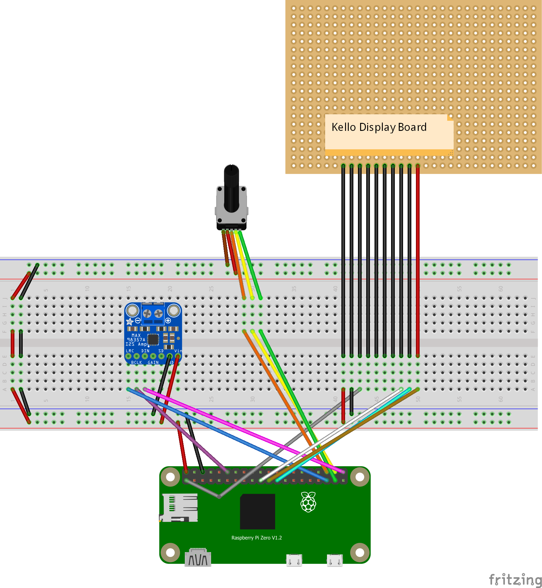

# alarm-clock

## Device Setup

I'm using a Pi Zero W.

Setup SSH - https://desertbot.io/blog/headless-pi-zero-w-wifi-setup-windows

VS Code over SSH - https://github.com/SchoofsKelvin/vscode-sshfs

Installing Node - https://www.thepolyglotdeveloper.com/2018/03/install-nodejs-raspberry-pi-zero-w-nodesource/

```
> curl -o node-v10.9.0-linux-armv6l.tar.gz https://nodejs.org/dist/v10.9.0/node-v10.9.0-linux-armv6l.tar.gz

> tar -xzf node-v10.9.0-linux-armv6l.tar.gz

> sudo cp -r node-v10.9.0-linux-armv6l/* /usr/local
```

Speaker setup: https://www.lucadentella.it/en/2017/04/26/raspberry-pi-zero-audio-output-via-i2s/

Alarm service definition:

```
[Unit]
Description=Alarm Clock
After=network.target
StartLimitIntervalSec=0

[Service]
Type=simple
Restart=always
RestartSec=3
ExecStart=/usr/bin/env node /home/pi/lights/server.js

[Install]
WantedBy=multi-user.target
```

`/home/pi/lights` is wherever you cloned this repo. `lights` is just a holdover on my device from when I was experimenting with the display.

### Wiring



1. Orange - Rotary Encoder SW
2. Yellow - Rotary Encoder DT
3. Green - Rotary Encoder CLK
4. White - Kello Display CS
5. Brown - Kello Display WR
6. Cyan - Kello Display DATA
7. Blue - I2S LRC
8. Purple - I2S BCLK
9. Pink - I2S DIN
10. Red - 5v + (Except on Kello ribbon, which is colored as in real life)
11. Black - GND (Except on Kello ribbon, which is colored as in real life)
12. Grey - 3.5v +
